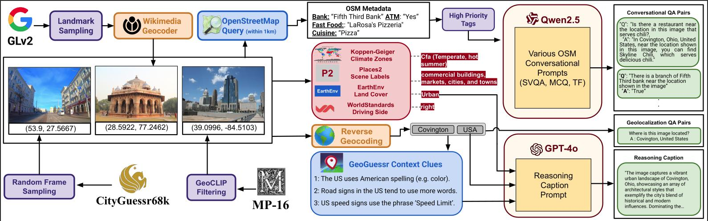
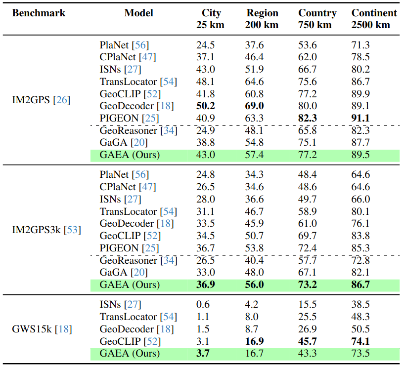

<h1 align="center"> GAEA: A Geolocation Aware Conversational Assistant</h1>

<p align="center">
    
</p>

<p align="left">
   <a href="https://github.com/UCF-CRCV/GAEA/blob/main/LICENSE"></a>
</p>

[Ron Campos](https://scholar.google.com/citations?user=qPH4IRIAAAAJ&hl=en)* , [Ashmal Vayani](https://scholar.google.com/citations?user=K4KF1SwAAAAJ&hl=en&oi=ao)* , [Parth Parag Kulkarni](https://scholar.google.com/citations?user=OHC7c90AAAAJ&hl=en)*, [Rohit Gupta](https://scholar.google.com/citations?user=0WukQpMAAAAJ&hl=en&oi=ao) , [Aizan Zafar](https://scholar.google.com/citations?user=iqYHEnsAAAAJ&hl=en&oi=ao), [Aritra Dutta](https://scholar.google.com/citations?user=vquoiHsAAAAJ&hl=en) , [Mubarak Shah](https://scholar.google.com/citations?user=p8gsO3gAAAAJ&hl=en&oi=ao)
###### * Equally contributing first authors

#### University of Central Florida

[](https://arxiv.org/abs/2503.16423)
[](https://huggingface.co/collections/ucf-crcv/gaea-67d514a61d48eb1708b13a08)
[](https://ucf-crcv.github.io/GAEA/)

<h5 align="left"> If you like our project, please give us a star ⭐ on GitHub for the latest update.</h5>

#### Official GitHub repository for  `GAEA: A Geolocation Aware Conversational Assistant`.
---

## 📢 Latest Updates
- **Aug-02-25**- Datasets and Model are released [HuggingFace](https://huggingface.co/collections/ucf-crcv/gaea-67d514a61d48eb1708b13a08)! 🔥🔥
- **Mar-20-25**- Technical report of GAEA is released on [arxiv](https://arxiv.org/abs/2503.16423)! 🔥🔥
- **Mar-20-25**- *GAEA-1.4M, GAEA-Bench Dataset* and codes are released. GAEA-Bench 4,000 diverse conversational QA pairs equipped with geolocalization capabilities. GAEA1.4M entails over 1.4M QA pairs for enhancing the conversational capabilities of geolocalizable LMM, GAEA. 🔥🔥

---

## 🏆 Highlights


> <p align="justify"> <b> <span style="color: blue;">Figure: Data Collection and Annotation Pipeline.</span></b> <i>(Left): </i> GAEA-1.4M includes geographically diverse visual samples from various data sources, such as MP-16, GLD-v2, and CityGuesser68k. <i>(Middle): </i> We also incorporate OpenStreetMap (OSM) metadata and auxiliary context for each image, ranging from climate zones to geographical clues about the country. <i>(Right): </i> Using open-source LLMs and GPT-4o, we generate four diverse question-answer pairs across geolocation, reasoning, and conversational subsets.


> **<p align="justify"> Abstract:** Image geolocalization, in which, traditionally, an AI model predicts the precise GPS coordinates of an image is a challenging task with many downstream applications. However, the user cannot utilize the model to further their knowledge other than the GPS coordinate; the model lacks an understanding of the location and the conversational ability to communicate with the user. In recent days, with tremendous progress of large multimodal models (LMMs)—proprietary and open-source—researchers attempted to geolocalize images via LMMs. However, the issues remain unaddressed; beyond general tasks, for more specialized downstream tasks, one of which is geolocalization, LMMs struggle. In this work, we propose to solve this problem by introducing a conversational model `GAEA` that can provide information regarding the location of an image, as required by a user. No large-scale dataset enabling the training of such a model exists. Thus we propose a comprehensive dataset `GAEA-1.4M` with 800K images and around 1.4M question-answer pairs constructed by leveraging OpenStreetMap (OSM) attributes and geographical context clues. For quantitative evaluation, we propose a diverse benchmark, `GAEA-Bench` comprising 4K image-text pairs to evaluate conversational capabilities equipped with diverse question types. We consider 11 state-of-the-art open-source and proprietary LMMs and demonstrate that `GAEA` significantly outperforms the best open-source model, LLaVA-OneVision by 25.69% and best proprietary model, GPT-4o by 8.28%. We will publicly release our dataset and codes. </p>

## `GAEA` is the first open-source conversational model for conversational capabilities equipped with global-scale geolocalization.

**Main contributions:**
1) **`GAEA-1.4M: A Diverse Training Dataset:`** We propose GAEA-1.4M, a new dataset designed for training conversational image geolocalization models, incorporating diverse visual and contextual data.
2) **`GAEA-Bench: Evaluating Conversational Geolocalization:`** To assess conversational capabilities in geolocalization, we introduce GAEA-Bench, a benchmark featuring various question-answer formats.
3) **`GAEA: An Interactive Geolocalization Chatbot:`** We present GAEA, a conversational chatbot that extends beyond geolocalization to provide rich contextual insights about locations from images.
4) **`Benchmarking Against State-of-the-Art LMMs:`** We quantitatively compare our model's performance against 8 open-source and 3 proprietary LMMs, including GPT-4o and Gemini-2.0-Flash.
   
<hr />


## 🗂️ Dataset

### `GAEA-1.4M` Dataset Overview
<p align="center">
   </a>
</p>

> <p align="justify"> <b> <span style="color: blue;">Figure: Data Collection and Annotation Pipeline.</span></b> <b> (Left)</b> GAEA-1.4M includes geographically diverse visual samples from various data sources, such as MP-16, GLD-v2, and CityGuesser68k. <b> (Middle)</b> We also incorporate OpenStreetMap (OSM) metadata and auxiliary context for each image, ranging from climate zones to geographical clues about the country. <b>(Right)</b> Using open-source LLMs and GPT-4o, we generate four diverse question-answer pairs across geolocation, reasoning, and conversational subsets. </p>


### `GAEA-Bench` Curation Pipeline
<p align="center">
   </a>
</p>

> <p align="justify"> <b> <span style="color: blue;">Figure: Overview of `GAEA-Bench`.</span></b> `GAEA-Bench` is designed to evaluate the conversational abilities of various LMMs across different question types, including MCQs, T/F, and both short and long VQAs. We have carefully selected a subset of 4k samples from MP-16 and generated corresponding OSM metadata to generate QA pairs using GPT-4o. `GAEA-Bench` aims to fill the gap in conversational benchmarks by incorporating geolocalization capabilities. </p>

<hr />


### Conversational Evaluation Pipeline
<p align="center">
   </a>
</p>

> <p align="justify"> <b> <span style="color: blue;">Figure:</span></b> The Evaluation pipeline highlights various question types we introduce in our <i>GAEA-Bench</i>. We use GPT-4o as a judge to score such responses on different criterion. </p>

<hr />


### Classification Accuracy Evaluation Pipeline
<p align="center">
   </a>
</p>

> <p align="justify"> <b> <span style="color: blue;">Figure:</span></b> Our classification accuracy pipeline evaluates city and country predictions by comparing them against ground truth annotations derived from GPS coordinates, with GPT-4o serving as the evaluator. </p>

<hr />

### Dataset Statistics

| Statistic                          | Value       |
|-------------------------------------|------------|
| **Total images**                    | 822,951    |
| **Total cities / countries**         | 41,481 / 234 |
| **Total questions**                  | 1,432,519  |
| **Total geo-localization questions** | 822,951    |
| **Total explanatory captions**       | 236,935    |
| **Total open-ended questions**       | 267,668    |
| **Total multiple-choice questions**  | 48,673     |
| **Total true/false questions**       | 56,292     |


## Qualitative Example of GAEA-1.4M
<p align="center">
   </a>
</p>

> <p align="justify"> <b> <span style="color: blue;">Figure:</span></b> We showcase various question-types including multiple-choice, true/false, short and long VQAs generated using an open-source model on our GAEA-1.4M dataset. We carefully select geographical tags from OSM metadata to generate diverse question types. </p>

<hr />

## Training
### Downloading and Setting Up GAEA-1.4M Dataset
GAEA-1.4M dataset can be downloaded from our [huggingface](https://huggingface.co/datasets/ucf-crcv/GAEA-Train). GAEA-1.4M consists of 1.4M question-answer (MCQ) pairs spanning four question types: MCQs, TF, and Short and Long VQAs. The general structure of our dataset looks like the following:

```
GAEA-1.4M/
|–– MP-16/
|   |–– ###/
|   |   |–– ###/
|   |   |   |–– ##########jpg
|   |   |   |–– ... # remaining images
|   |–– ... # remaining folders with similar structure
|–– GLDv2/
|   |–– #/
|   |   |–– #/
|   |   |   |–– #/
|   |   |   |   |–– ##########.jpg
|   |   |   |   |–– ... # remaining images
|   |–– ... # remaining folders with similar structure
|–– CityGuessr/
|   |–– city_#_######.jpg
|   |–– ... # remaining images
```

Download the dataset
```shell
# Download the GAEA-1.4M dataset
cd scripts

chmod +x download_gaea_train.sh
./download_gaea_train.sh
```

Download the weights to Qwen2.5-VL
```shell
# Download Qwen2.5-VL base model
git lfs install
git clone https://huggingface.co/Qwen/Qwen2.5-VL-7B-Instruct
```

### Installation
```shell
conda create -n gaea python=3.10
conda activate gaea

pip install torch==2.5.1 torchvision==0.20.1 torchaudio==2.5.1 --index-url https://download.pytorch.org/whl/cu121

pip install -r requirements.txt
pip install qwen-vl-utils
pip install flash-attn==2.5.8 --no-build-isolation
```

Please install the latest transformers from git to finetune Qwen2.5-VL

```
pip install git+https://github.com/huggingface/transformers accelerate
```

### Training
```shell
cd scripts

chmod +x train_gaea.sh #make script executable.
./train_gaea.sh
```

## Evaluation
### Downloading and Setting Up GAEA-Bench Dataset
GAEA-Bench dataset can be downloaded from our [huggingface](https://huggingface.co/datasets/ucf-crcv/GAEA-Bench). GAEA-Bench consists of 4k conversational QA pairs extended from MP-16 and OpenStreetMaps (OSM) in various question types, including MCQs, TF, and Short and Long VQAs. 

```shell
# Download the GAEA-Bench dataset
cd scripts

chmod +x download_gaea_bench.sh
./download_gaea_bench.sh
```

### Preparing the dataset

```shell
# Organize the GAEA
cd scripts

chmod +x prepare_gaea_bench.sh
./prepare_gaea_bench.sh
```


#### Conversational `GAEA-Bench` Evaluation
Run the following command for evaluation
```shell
cd scripts

chmod +x run_gaea_bench.sh #make script executable.
./run_gaea_bench.sh
```

#### Standard Geolocalization Evaluation
Install IM2GPS, IM2GPS3k, YFCC4k, YFCC26k, and GWS15k to run the evaluation. After installation, update the paths in the shell script and run the evaluation command.

```shell
cd scripts

chmod +x run_distance_metrics.sh #make script executable.
./run_distance_metrics.sh
```

#### Classification Accuracy Evaluation

Install CityGuessr, GeoDE, and Dollar Street to run the evaluation. After installation, update the paths in the shell script and run the evaluation command.

```shell
cd scripts

chmod +x run_cc_preds.sh #make script executable.
./run_cc_preds.sh
```


## Benchmarking and Evaluation Results

#### GAEA-Bench Evaluation
<p align="center">
   </a>
   </a>
</p>

> <p align="justify"> <b> <span style="color: blue;">Figure:</span></b> We benchmark 11 open-source and proprietary LMMs on <i>GAEA-Bench</i>. Notably, <i>GAEA</i> outperforms all open-source models and fares higher than the proprietary models on decision making questions <i>(MCQs and TFs)</i>. We provide the relative performance change for each model compared to `GAEA`. </p>

<hr />

#### Standard Geolocalization Evaluation Results
<p align="center">
   </a>
</p>

> <p align="justify"> <b> <span style="color: blue;">Figure:</span></b> We benchmark the performance of various specialized models on standard geolocation datasets. `GAEA` demonstrates competitive results, outperforming GaGA on multiple distance thresholds in both IM2GPS and IM2GPS3k. </p>

<hr />

#### Classification Accuracy Evaluation Results
<p align="center">
   </a>
</p>

> <p align="justify"> <b> <span style="color: blue;">Figure:</span></b> Classification accuracy for both city and country labels, where `GAEA` establishes itself as a strong baseline, surpassing several recent LMMs in performance. </p>

<hr />


## 📂 License
This work is licensed under a Creative Commons Attribution-NonCommercial-ShareAlike 4.0 International License. The images in `GAEA` and `GAEA-Bench` dataset are collected from public domains and sources (refer to [main paper]() for more details) and are for academic research use only. 
By using `GAEA` and `GAEA-Bench`, you agree not to use the dataset for any harm or unfair discrimination. Please note that the data in this dataset may be subject to other agreements. Video copyrights belong to the original dataset providers, video creators, or platforms.

## 📜 Citation
If you find our work and this repository useful, please consider giving our repo a star and citing our paper as follows:
```bibtex
@misc{campos2025gaeageolocationawareconversational,
      title={GAEA: A Geolocation Aware Conversational Assistant}, 
      author={Ron Campos and Ashmal Vayani and Parth Parag Kulkarni and Rohit Gupta and Aritra Dutta and Mubarak Shah},
      year={2025},
      eprint={2503.16423},
      archivePrefix={arXiv},
      primaryClass={cs.CV},
      url={https://arxiv.org/abs/2503.16423}, 
}
```

## 🙏 Acknowledgements

This repository has borrowed Video-LMM evaluation code from [TimeChat](https://github.com/RenShuhuai-Andy/TimeChat) and [LLaMA-VID](https://github.com/dvlab-research/LLaMA-VID). We also borrowed partial code from [ALM-Bench](https://github.com/mbzuai-oryx/ALM-Bench/), [CVRR-Evaluation-Suit](https://github.com/mbzuai-oryx/CVRR-Evaluation-Suite) repository. We thank the authors for releasing their code.

---
<p align="center">
   <a href="https://www.crcv.ucf.edu/"></a>
</p>
